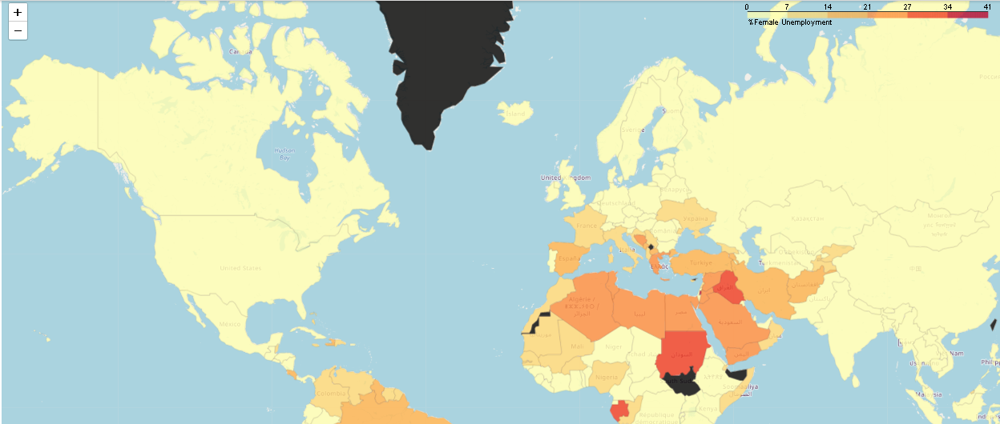
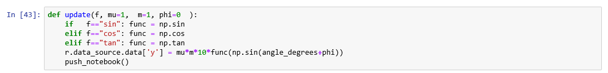
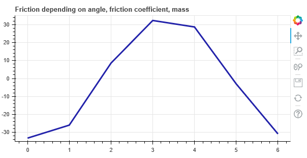
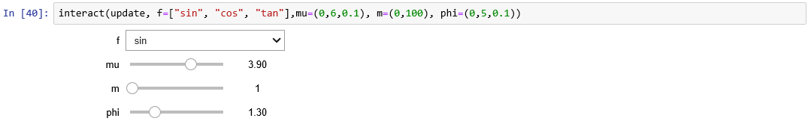

## Project Basic Statistics with Python (ANOVA) (Coursera)

The indicator selected to do all the stats calculation is % Unemployment for Females (Worldwide). 

Finally, the indicator data is displayed using folium choropleth.

Table of Contents

<ul><li>Download data, upload data, read data into pandas</li>
<li>Cleaning the data by sorting and merging 2 data sets and dropping unnecessary columns</li>
<li>Selecting 1 indicator </li>
<li>Merging 2 data sets: % Unemployment and income group by country </li>
<li> Removing all the NAN values and countries without values </li>
<li> Calculating main stats of the data set (mean, std, quartiles) </li>
<li> Transpose the data year column, income groups as index </li>
<li> Display mean % Female Unemployment by Income Group and Year </li>

<li> Display mean % Female Unemployment by Region and Year </li>
<li> ANOVA Calculation of Income Group Data and boxplot display</li>  
<li> Selecting 2019 data </li>  
<li> the indicator data for selected year is displayed using folium choropleth </li></ul>

 

************************************************************************************************************************************

## Project iPywidgets with Bokeh

This demo shows off an interactive visualization using Bokeh for plotting and ipywidgets interactors. No Bokeh server required. The demo runs entirely inside Jupyter notebook.

The impact of the mass, friction coefficient, and phase is analyzed within  the friction equation for a block of mass m. The block is on a inclined plane with angle x. 

First BokehJS is loaded successfully.  Angle degrees and the friction funtion is defined next.

The chart and plot line options are selected (height, width, chart title, vertical axe range).

 

The function 'update' will build the scroll down list with the diferrent trogonometric functions to see the impact of each of them  in the friction of the block. 

Display of the friction chart follows. Final step, interact command display all the interactors.
 Friction equation can be studied. 

The impact of the selected variables (mass, friction coefficient, phase) analyze.

 

